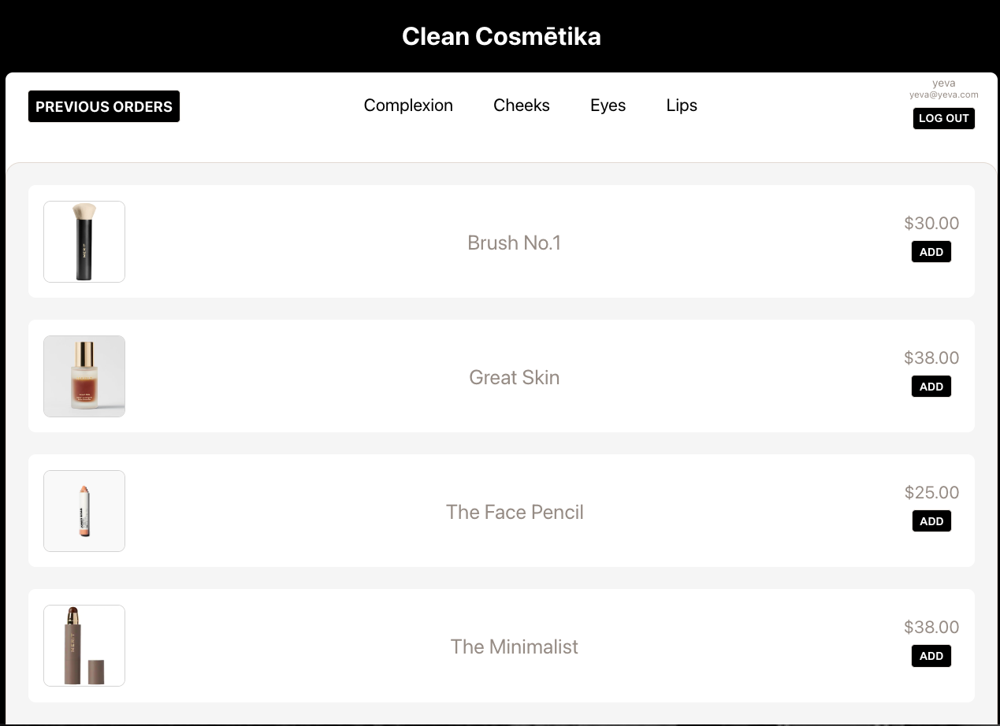
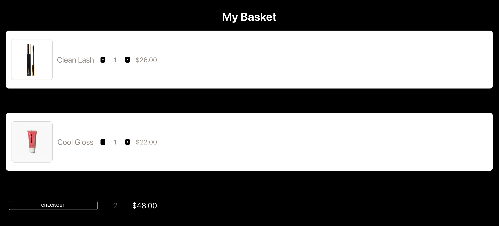

# Clean Cosmētika 
An app for clean make up lovers to shop high end quality brands.  

[Deployed App](https://cleancosmetika.herokuapp.com/)  
[Trello Board](https://trello.com/b/T1BnWW3B/unit-3-project)

# Design

## Technologies Used
HTML, JavaScript, CSS, React, Node, Express, MongoDB

## Unsolved Problems

## Fututre Improvements 
The user will be able to add items to favorites, a show page for each product, and a seperate page for the cart. Also, add in a payment platform for checkout like Stripe. 

